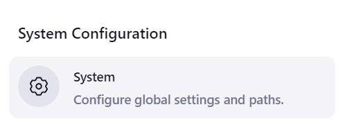

# Send Emails through Program

This repository contains a Python program for sending emails to a list of recipients. The program reads email addresses from a text file and sends a fixed email message to each recipient.

## Components

### Python Script (`send_email.py`)

The `send_email.py` Python script is the core component of the program. It performs the following tasks:

1. **Read Recipients**: The script reads email addresses from a text file named `recipients.txt`. Each email address should be listed on a separate line in the text file.

2. **Construct Email Message**: It constructs the email message with a fixed subject and body. In this case, the subject is "Hello" and the body is "Hello, this email....". These values can be customized according to your requirements.

3. **Send Emails**: Using the `smtplib` library, the script connects to an SMTP (Simple Mail Transfer Protocol) server (in this case, Gmail's SMTP server), authenticates with the sender's email address and password, and sends the email messages to the list of recipients.

### Recipients File (`recipients.txt`)

The `recipients.txt` file contains a list of email addresses, each on a separate line. This file serves as input to the Python script, providing the email addresses to which the emails will be sent.

## Usage

### Setting Up Environment Variables in Jenkins

1. Log in to your Jenkins dashboard. \
   
2. Go to "Manage Jenkins" > "Configure System". \
   \
   
4. Scroll down to the "Global properties" section.

5. Check the "Environment variables" checkbox.

6. Add environment variables:
   - `SENDER_EMAIL`: The sender's email address.
   - `SENDER_PASSWORD`: The sender's email password. \
    \
   Ensure these environment variables are set in Jenkins before running the program.

### Installing Required Libraries

Before running the Python script, you need to ensure that the required libraries are installed in your Python environment. 

- **secure-smtplib**: This library provides a secure implementation of the SMTP protocol for sending emails over SSL/TLS connections. It enhances the security of email transmission.

- **email**: The `email` library is used for creating, parsing, and handling email messages in Python. It provides functionality for constructing complex email messages with attachments, HTML content, and more.

To install these libraries, you can use pip:

```bash
pip install secure-smtplib email
```

### Creating a Jenkins Job

1. Log in to your Jenkins dashboard.

2. Click on "New Item" to create a new Jenkins job.

3. Enter a name for your job (e.g., "Send Email Job").

4. Select the appropriate job type (Freestyle project or Pipeline) and click "OK". \
   
5. Configure the job:
   - In the job configuration page, specify the GitHub repository URL containing the Python script (`send_email.py`) and the recipients file (`recipients.txt`). Specify the branch. \
     
   - Add a build step to execute the Python script by adding a shell command:
     ```bash
     python send_email.py
     ```
     (In my case, the libraries necessary for program are installed in python 3.12 environment.) \
     
   - Optionally, configure build triggers and post-build actions according to your requirements.

6. Save the job configuration.
7. Now build the job. \
    \
You can see the status of job. \
    \
Check console output of job. \
     \
This is how the recipients will see the email- \
    

## Note

- Ensure that the sender's email address and password are stored securely as environment variables in the Jenkins environment to prevent unauthorized access to sensitive information.

- Make sure you have edited the recipient list before executing the program.

- **2-Factor Authentication**: If 2-factor authentication is enabled for your Google account, you need to use an app password instead of your regular password. Visit [this link](https://myaccount.google.com/u/0/apppasswords) to generate an app password for your Gmail account. Use the generated 16-digit code instead of your password in the `SENDER_PASSWORD` environment variable.

- **Less Secure Apps**: If you have 2-factor authentication disabled, you may need to allow less secure apps to access your Gmail account. Visit [this link](https://myaccount.google.com/u/0/lesssecureapps) to enable the option. However, Google recommends using app passwords instead.

For more information on sending emails with Python, you can refer to the following resources:
- [Python - Sending Email (Tutorialspoint)](https://www.tutorialspoint.com/python/python_sending_email.htm)
- [Sending Emails With Python (Real Python)](https://realpython.com/python-send-email/)